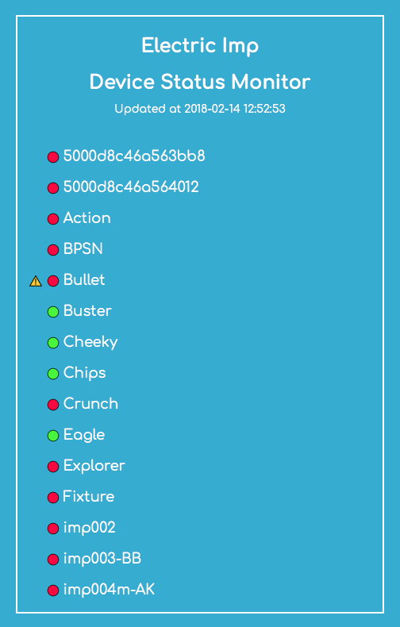

# impMonitor #

impMonitor provides an example of how an agent can both interact with Electric Imp’s [impCentral™ API](https://developer.electricimp.com/tools/impcentralapi) and serve its own web page to display the results.

impMonitor provides a handy readout of all your development devices’ online status: green for online, red for disconnected. If a device’s status changes between updates (currently every 60 seconds; this can be changed by altering the value of the agent code’s *LOOP_TIME* constant) a warning triangle indicates the fact.

### Agent Code ###

All the work is performed by the agent code. It logs in to the impCentral API using your own Electric Imp account credentials, which you need to add to the code in the area marked. Please take great care, especially if you share your version of this code, not to allow others to view your account credentials.

The code retrieves a list of all your development devices. It uses the list to generate the web UI, which is served by the agent itself using the [Rocky library](https://developer.electricimp.com/libraries/utilities/rocky). The list is stored and, when a fresh list is retrieved in due course, used to track devices’ status between checks to see if any change has taken place.

The UI includes PNG graphics for the status and other indicators, and these are embedded in the code as hexadecimal strings. This example includes these hex strings in separate files — you’ll need to paste their contents into the agent code where indicated, or use a third-party tool to merge the files for you.

If you wish to change the graphics, you will need to convert them to hex strings by opening them in a tool capable of presenting a hex readout of any file. The bundled files were generated with BBEdit on macOS, but there are many other such tools you can use. Take care when editing not to alter the data, and make sure each octet is correctly prefixed with `\x` to tell Squirrel that it should read the string as a sequence of bytes rather than series of characters.

The web page uses JavaScript to auto-update separately from the impCentral device check. As such, it can be opened in a web browser — enter the URL of your agent — and kept to the side of your screen, or on a separate device, as a live status readout.

### Device Code ###

The device code does very little, but is required. Agents are maintained only for devices that connect to the Electric Imp impCloud™. As such, this app requires a device which just checks in twice a day to ensure the agent is never closed down. You can adjust the value of the device code’s *SLEEP_TIME* constant to set the device to sleep for longer periods than the default 12 hours. In fact, the device needs only check in with the server every 30 days to keep the agent running.

### Extending the Code ###

The impCentral API’s [standard device record](https://apidoc.electricimp.com/#tag/Devices%2Fpaths%2F~1devices%2Fget) contains much more information than is included here, so one way to extend the code is to extract more data about each device and present that data in the UI. The key areas to change are the *ENTRY_START* and *ENTRY_END* constants, which define the HTML code used to present each listed device, and the function *getDeviceData()*, which uses those HTML constants to build each device’s listing, including its name and the status indicator graphics.

## License ##

impMonitor is made available under the [MIT Licence](./LICENSE).

Copyright (c) 2018, Electric Imp, Inc.
